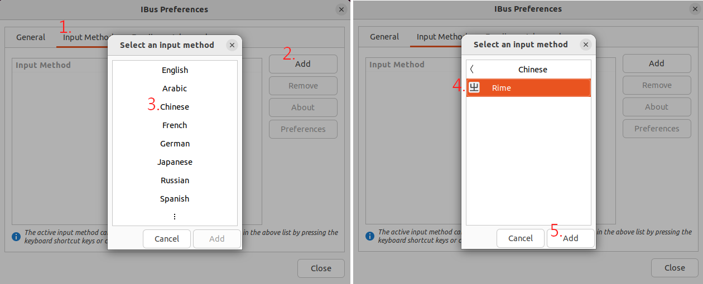
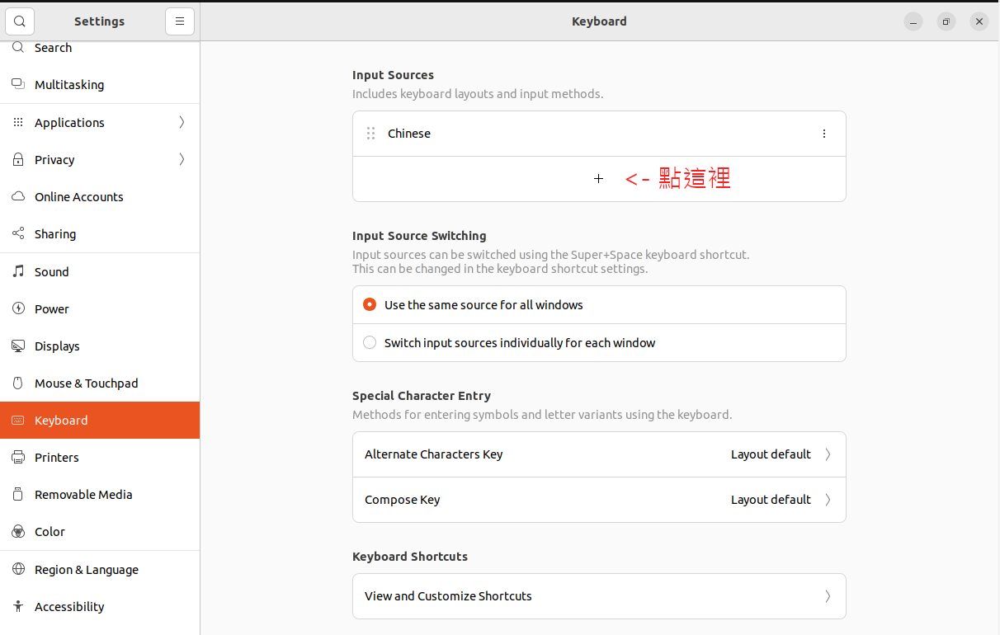
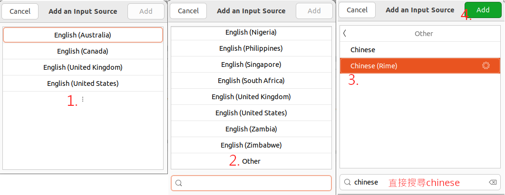
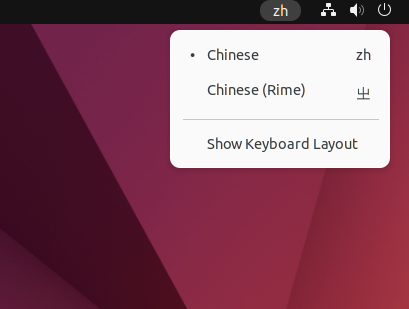

因為我用的是Ubuntu，所以用Ubuntu來講解如何安裝ibus-rime。

# 安裝ibus和ibus-rime

```bash
sudo apt update
sudo apt install ibus-rime # 自動安裝 ibus
```

# 啟用ibus-rime

## Step 1 - 將Rime加入ibus中

首先從終端開啟ibus的設定介面：

```bash
ibus-setup   # 開啟 ibus 的設定
```

然後依下面步驟，將Rime加入Input Method中：



## Step2 - 將Rime加入系統設置中

在「Settings」->「Keyboard」下我們要將「Chinese (Rime)」加入input sources中。

先點擊下方的「+」號：



然後選擇「Chinese (Rime)」，它藏的還蠻深的，具體找法如下圖：



# 切換成Rime輸入法

經過上方的設置後，應該就能在狀態欄找到切換輸入法的圖示，如圖。如果沒出現可以試著重開機。

