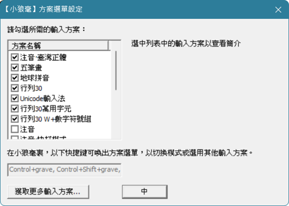

「部署」是啟用輸入方案前必經的一個步驟，目的是讓Rime能夠瞭解輸入方案的實作。基本上有兩個步驟：

1. 在`default.yaml`的`schema_list`中加入要啟用的輸入方案
2. 點擊GUI上「重新部署」的按鈕

# 修改schema_list

## 使用文字編輯器

雖然說是要修改`default.yaml`，但一般會比較推薦將要改的內容寫在`default.custom.yaml`中。RIME把`default.custom.yaml`稱作`default.yaml`的[補靪](file_format.md#補靪文件)，正如其名，補靪包含著對原文件的修改，在部署時補靪會被合併進原文件中。

在用戶資料夾下新增`default.custom.yaml`，然後打入下列文字。

```yaml
# default.custom.yaml
patch:
  "schema_list/+":
    - schema: foo_schema1
    - schema: foo_schema2
    # etc...
```

補靪文件以`patch:`起頭，之後縮排寫下要修改的項目。其中`"schema_list/+"`代表在原本的`schema_list`下新增內容，接下來以`- schema:`開頭的每一列都是一個要啟用的輸入方案。

記得將「foo_schema1」、「foo_schema2」換成輸入方案的名稱，輸入方案的名稱為檔名`×××.schema.yaml`中`×××`的部分。

## 使用GUI

如果你用的是「小狼毫」、「鼠鬚管」或「Trime」，那你可以直接透過GUI來修改schema_list。

發行版 | 方法
---    |---
小狼毫 | 1. 開啟「輸入法設定」<br> 2. 勾選欲啟用的輸入方案 <br> 3. 點擊「中」 <br> 
鼠鬚管 | *沒用過，待補上*
Trime | 1. 開啟Trime的設定 <br> 2. 點擊「方案」 <br> 3. 點擊「啓用方案」 <br> 4. 勾選欲啓用的方案

# 重新部署

不同的發行版有不同的重新部署的方式。

發行版 | 方法
---|---
小狼毫 | 右鍵點擊工作列上中英切換的icon，然後點重新部署
鼠鬚管 | *沒用過，待補上*
ibus_rime | 點擊工作列上輸入法的圖示，點部署
Trime | 開啟Trime的設定，點擊右上方的部署


