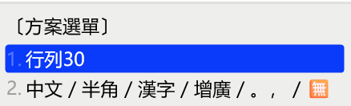

`default.yaml`主要可以用來設定下面這些組件：

- schema_list - 部署時要啟用的輸入方案
- ascii_composer - 中英切換
- switcher - 方案選單
- menu - 候選字列表
- key_binder - 自定義按鍵
- punctuator - 標點符號
- *recognizer - 在default.yaml中設定recognizer沒太大用處，先不講*

其中`menu`、`key_binder`、`punctuator`、`recognizer`都能在輸入方案中進行個別設定。

# schema_list

```yaml
schema_list:
  - schema: foo_schema1
  - schema: foo_schema2
```

# ascii_composer

中英切換

```yaml
ascii_composer:
  good_old_caps_lock: true
  switch_key:               # 可以進行中英切換的按鍵
    Shift_L: inline_ascii   # inline_ascii -> 保留輸入碼
    Shift_R: commit_text    # commit_text -> 先上屏候選字，再切英文
    Control_L: noop         # noop -> 不能切英文
    Control_R: noop
    Caps_Lock: noop
    Eisu_toggle: clear      # clear -> 清空輸入碼，再切英文
```

# switcher

方案選單

```yaml
switcher:
  caption: 〔方案選單〕      # 方案選單的標題
  hotkeys:                  # 開啟方案選單的按鍵
    - Control+grave
    - Control+Shift+grave
    - F4
  save_options:
    - full_shape
    - ascii_punct
    - simplification
    - extended_charset
    - zh_hant
    - zh_hans
    - zh_hant_tw
  fold_options: true            # 是否將開關摺疊
  abbreviate_options: true      # 若摺疊的話，是否使用縮寫
  option_list_separator: '／'   # 若摺疊的話，每個開關的分隔符
```

`fold_options: true`且`abbreviate_options: false`的示例：


# menu

```yaml
menu:
  alternative_select_labels: [ ①, ②, ③, ④, ⑤, ⑥, ⑦, ⑧, ⑨ ]  # 修改候選標籤
  alternative_select_keys: ASDFGHJKL #如編碼字符佔用數字鍵則須另設選字鍵
  page_size: 9 # 每頁最多的候選字個數
```

# key_binder

詳細說明看[標準庫](https://github.com/LEOYoon-Tsaw/Rime_collections/blob/master/Rime_description.md#%E5%85%AB%E5%85%B6%E5%AE%83)

範例：
```yaml
key_binder:
  bindings:
  - { accept: "Shift+space", toggle: full_shape, when: always }
  - { accept: bracketleft, send: Page_Up, when: has_menu }
  - { accept: bracketright, send: Page_Down, when: has_menu }
```

> [!Note]
> key_binder送出的按鍵只能給Rime使用，不會發給作業系統。
> 
> 所以你不能做出「空格」轉「Backspace」之類的，然後希望能用空格鍵來刪除屏幕上的文字；這樣做頂多只能用來刪除輸入碼。
>
> https://github.com/hchunhui/librime-lua/issues/216#issuecomment-1357738480

# punctuator

```yaml
punctuator:
  half_shape:
    # 半型模式下的映射關係
  full_shape:
    # 全型模式下的映射去關係
```

映射關係為數組映射（mapping），以「源碼」為key，「候選字」為value。

例如：
```yaml
full_shape:
  ' ' : { commit: '　' }
  ',' : { commit: ， }
  '.' : { commit: 。 } #直接上屏
  '<' : [ 《, 〈, «, ‹ ]
  '>' : [ 》, 〉, », › ]
  '/' : [ ／, ÷ ] #多個候選字
  '''' : { pair: [ '‘', '’' ] } #以pair表示多個候選字
  '"' : { pair: [ '“', '”' ] }
  '_' : ——
  '+' : ＋
  '=' : ＝ #單個候選字
```